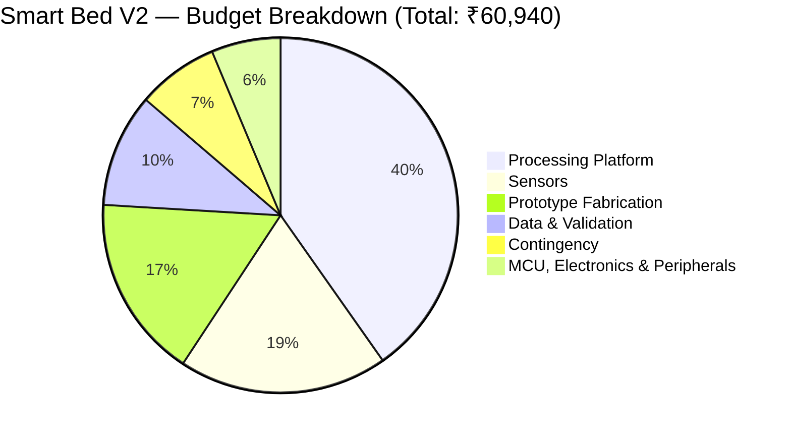

# Budget Slide Content — Smart Bed V2 Proposal

> **Usage:** This file contains all content needed for a single budget slide in your project proposal presentation.
> The Mermaid pie chart renders natively in GitHub, Obsidian, and Notion. For PowerPoint/Google Slides, screenshot the rendered chart or recreate it as a built-in pie/donut chart using the percentages below.

---

## 🎯 Slide Title

**Smart Bed V2 — Research Prototype Budget**

---

## 📝 Slide Descriptor Text (2–3 sentences max)

> A total prototype budget of **₹60,940–₹63,740** funds five sensor modalities, an AI-capable edge computing platform, mechanical fabrication, and clinical validation — well within the ₹1,00,000 institutional limit. Clinical reference instruments (weighing scale, spirometer, pulse oximeter) are sourced through institutional labs wherever possible; a priced fallback of ₹2,800 is reserved in case any are unavailable.

---

## 📊 Primary Visual — Pie / Donut Chart

Render this in GitHub / Obsidian, or recreate as a donut chart in your presentation tool using the values below.



---

## 📋 Slide Table — Category-Wise Budget

| Category | Key Components | ₹ | % |
|---|---|---:|---:|
| 🖥️ Processing Platform | Raspberry Pi 5 (8 GB), active cooler, 64 GB microSD, 27 W PSU | 24,520 | 38.5% |
| 📡 Sensors | HLK-LD6002 radar, Velostat matrix ×4, load cells ×4, MLX90640 spatial camera, MLX90614 temp sensor | 11,600 | 18.2% |
| 🔧 Prototype Fabrication | Bed/cot, foam mattress, radar & camera mounts, cable management, enclosures | 10,160 | 15.9% |
| 🧪 Data & Validation | Calibration, consumables, volunteer honoraria, ethics docs + conditional clinical ref. instruments | 9,100 | 14.3% |
| ⚙️ MCU, Electronics & Peripherals | ESP32, HX711 ×2, mux ×3, ADS1115 ×2, passives, logic converters, RPi case, debug cables | 3,845 | 6.0% |
| 🛡️ Contingency (~8%) | Component failure, price variation, shipping buffer | 4,515 | 7.1% |
| | | | |
| **TOTAL (best case)** | *V2/V3/V4 via institutional labs* | **₹60,940** | — |
| **TOTAL (worst case)** | *V2/V3/V4 purchased (₹2,800 extra)* | **₹63,740** | — |
| **Surplus vs. ₹1,00,000 limit** | *Available for Phase 2* | **₹36,260–₹39,060** | — |

---

## 📌 Key Callout Stats
Place these as 4 highlight boxes / stat cards along the bottom of the slide.

| Stat | Value |
|---|---|
| 💰 Total Budget (best case) | ₹60,940 |
| 💰 Total Budget (worst case) | ₹63,740 |
| 🏛️ Funding Limit | ₹1,00,000 |
| ✅ Surplus for Phase 2 | ₹36,260–₹39,060 |
| 🏛️ Clinical instruments (V2/V3/V4) | ₹2,800 reserved as fallback |

---

## 🖼️ Recommended Slide Layout

```
┌─────────────────────────────────────────────────────────────────┐
│  SLIDE TITLE: Smart Bed V2 — Research Prototype Budget          │
├───────────────────────────┬─────────────────────────────────────┤
│                           │  CATEGORY TABLE                     │
│   PIE / DONUT CHART       │  (6 rows + total row)               │
│   (Mermaid or built-in    │                                     │
│    presentation chart)    │  Processing    ₹24,520   40.2%      │
│                           │  Sensors       ₹11,600   19.0%      │
│   [Colour legend below]   │  Fabrication   ₹10,160   16.7%      │
│                           │  Data/Valid.    ₹6,300   10.3%      │
│                           │  Electronics    ₹3,845    6.3%      │
│                           │  Contingency    ₹4,515    7.4%      │
│                           │  ──────────────────────────────     │
│                           │  TOTAL         ₹60,940   100%       │
├───────────────────────────┴─────────────────────────────────────┤
│  "A prototype budget of ₹60,940 funds five sensor modalities,   │
│  AI edge computing, fabrication & clinical validation —         │
│  well within the ₹1,00,000 limit. Surplus ₹39,060 → Phase 2."  │
├────────────────┬───────────────┬───────────────┬────────────────┤
│ Total: ₹60,940 │ Limit: ₹1 L   │ Surplus: ₹39K │ Inst. Access   │
│                │               │ (Phase 2 →)   │ saves ~₹20K    │
└────────────────┴───────────────┴───────────────┴────────────────┘
```

---

## 🎨 Colour Recommendations (PowerPoint / Google Slides)

| Category | Hex Colour | Swatch |
|---|---|---|
| Processing Platform | `#2E75B6` — Deep Blue | ████ |
| Sensors | `#C00000` — Deep Red | ████ |
| Prototype Fabrication | `#70AD47` — Green | ████ |
| Data & Validation | `#ED7D31` — Orange | ████ |
| MCU, Electronics & Peripherals | `#7030A0` — Purple | ████ |
| Contingency | `#00B0F0` — Teal | ████ |

---

## 💡 Presentation Tips

- **Use a donut chart** (not pie) — the hollow centre lets you place the total amount `₹60,940` inside for maximum impact.
- **Highlight the surplus** — a separate callout showing ₹39,060 available for Phase 2 demonstrates responsible budgeting to the committee.
- **Do not list all 30 items** — the 6-category table above is all you need on the slide.
- **Institutional access footnote** — add a small `*` note: *"Clinical validation equipment (weighing scale, spirometer, pulse oximeter) accessed via institutional labs — not purchased."*

---

*Source: ItemizedBudget.md · BudgetVerification.md · Smart Bed V2.pdf | August 2026*
