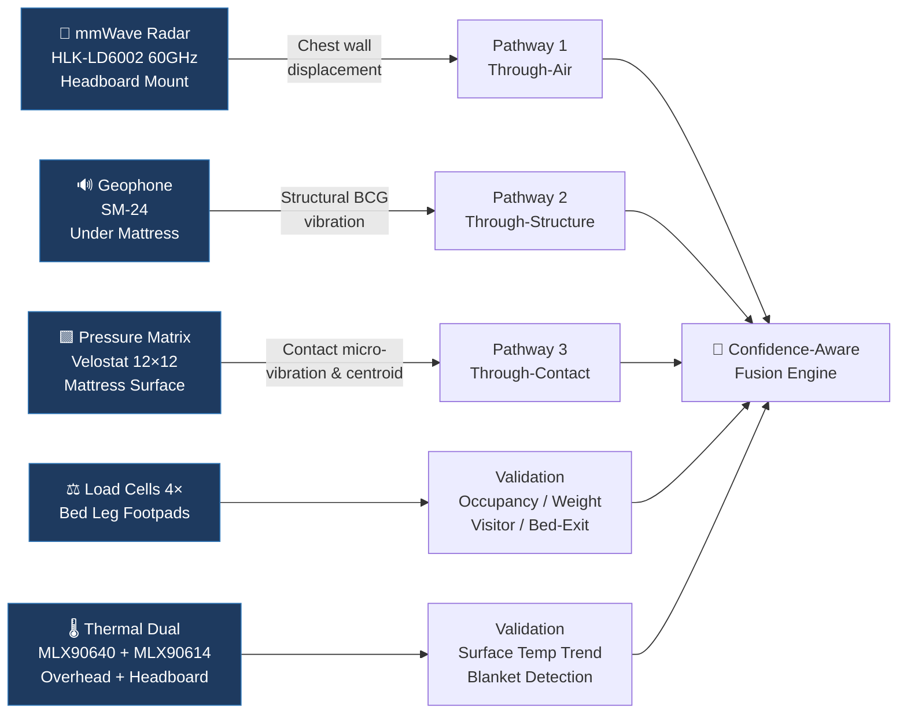
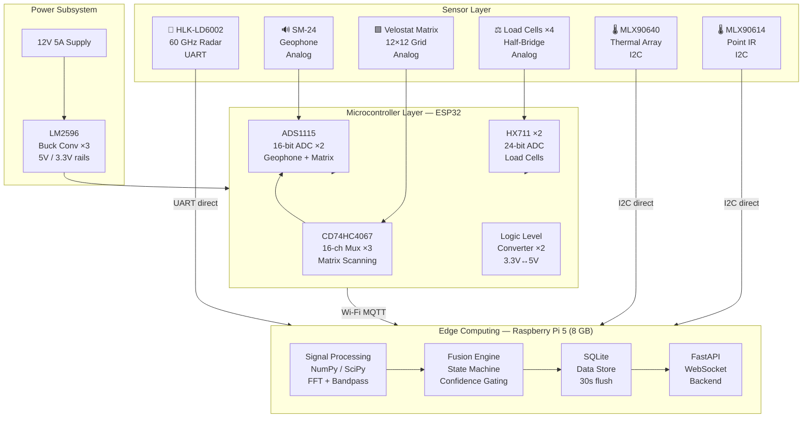
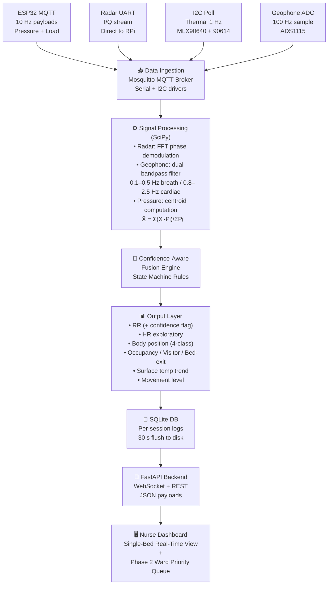
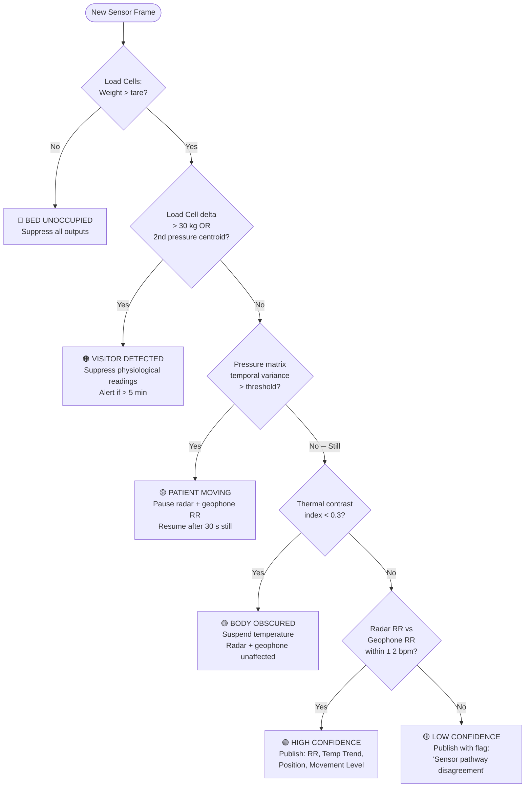
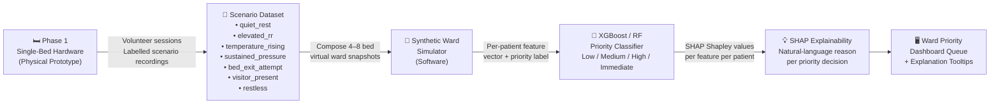

# Validated Concept
## AI-Powered Multimodal Contactless Patient Monitoring System — Smart Bed V2

**Project Vision:** Transform conventional hospital cots into intelligent, confidence-aware patient monitoring platforms at moderate cost — no new bed required.  
**Location:** Coimbatore, Tamil Nadu, India | **Budget:** ₹64,280 | **Phase 1 Scope:** Single-bed research prototype, lab validation

---

## 1. Core Concept

We retrofit existing single-person hospital metal cots with five non-contact sensors. No leads attach to the patient. The bed itself observes — heartbeat vibration through the mattress, chest displacement through the air, weight at the legs, posture through the mattress surface, and body heat from above.

The key research question is not just *"what is the patient's RR?"* but **"can we trust this reading right now?"** That confidence-awareness is the system's primary scientific contribution.

---

## 2. Five Sensors & Three Independent Physiological Pathways

### Sensor Placement

```
              ┌─────────────────────────────┐
              │   OVERHEAD ARM (1.2 m high) │
              │   MLX90640 Thermal Array    │ ← Spatial heat map, body outline, blanket detection
              └────────────┬────────────────┘
                           │ I2C
 ┌─────────────────────────┤─────────────────────────────────────┐
 │  HEADBOARD (0.6 m high) │                                     │
 │  HLK-LD6002 60GHz Radar ├── UART ──► RPi 5                   │
 │  MLX90614 Point IR Temp ├── I2C  ──► RPi 5                   │
 └─────────────────────────┤                                     │
                           │         ┌───────────────────────────┤
                           │         │   MATTRESS SURFACE (top)  │
                           │         │   Velostat Pressure Matrix │ ← Posture, movement, BCG
                           │         └──────────────┬────────────┘
                           │                        │ Analog → ADS1115 → ESP32
                           │         ┌──────────────┴────────────┐
                           │         │ UNDER MATTRESS            │
                           │         │ SM-24 Geophone            │ ← Structural BCG: HR + RR
                           │         └──────────────┬────────────┘
                           │                        │ Analog → ADS1115 → ESP32
                           └─────────────────────────────────────┘

 ┌─────────────────────────────────────────────────────────────────┐
 │  BED LEG FOOTPADS (all 4 legs)                                  │
 │  4× 50 kg half-bridge load cells  → HX711 ×2 → ESP32          │ ← Weight, occupancy, visitor, exit
 └─────────────────────────────────────────────────────────────────┘
```

### Three Independent HR/RR Pathways



| Sensor | Placement | Measures | Blanket-proof? | ₹ Cost |
|---|---|---|---|---|
| HLK-LD6002 Radar (60 GHz FMCW) | Headboard, 0.6 m, facing thorax | RR (primary), HR (exploratory) | Partially | 2,200 |
| SM-24 Geophone | Under mattress, beneath upper torso | RR + HR via structural BCG | ✅ Yes | 500 |
| Velostat Pressure Matrix (12×12) | Mattress surface, torso + hips | Body position, movement, pressure map | ✅ Yes | 3,800 |
| Load Cells ×4 + HX711 ×2 | All 4 bed leg footpads | Weight, occupancy, visitor (+30 kg), bed-exit | ✅ Yes | 540 |
| MLX90640 (32×24 px array) | Overhead arm, 1.2 m | Spatial thermal map, body outline, blanket | ❌ No | 5,000 |
| MLX90614 (±0.2°C point IR) | Headboard, aimed at forehead/chest | Surface temperature trend | ❌ No | 700 |

---

## 3. Hardware Architecture



---

## 4. Software Architecture & Data Flow Pipeline



---

## 5. Confidence-Aware Fusion Engine

This is the core research mechanism. The system decides **whether a reading can be trusted** before reporting it.



### Confidence Output States

| State | Trigger | Published Data |
|---|---|---|
| 🟢 **High Confidence** | Still, single occupant, radar + geophone agree | RR, exploratory HR, surface temp, position |
| 🟡 **Low Confidence** | Radar/geophone disagree by >2 bpm | RR with explicit flag |
| 🟠 **Visitor Detected** | Weight delta >30 kg + second centroid | Alert only — no physiological data |
| 🔴 **Body Obscured** | Thermal contrast drop | Temperature suspended; RR/geophone continue |
| ⬛ **Bed Unoccupied** | Load cells near tare | All outputs suppressed |

---

## 6. From One Bed to a Ward (Phase 2 — Software Only)

Phase 2 costs ₹0 in additional hardware. It is a pure software research extension using Phase 1 data.



**Example SHAP Output:**
> *"Bed 3 ranked HIGH PRIORITY — Elevated RR (+35% vs baseline, High Confidence): +0.42 · Sustained sacral pressure >2.2 h: +0.31 · Surface temp trend +0.7°C: +0.18"*

---

## 7. System Outputs & Clinical Framing

| Output | Classification | Claim Level |
|---|---|---|
| Respiratory Rate (radar + geophone) | Primary deliverable | Research prototype — RMSE <3 bpm target |
| Heart Rate | Exploratory | Document accuracy; no clinical claim |
| Body Position (4-class) | Strongly feasible | Pressure centroid → Supine / Lateral / Seated |
| Bed Occupancy | Strongly feasible | Load cells + pressure, highest confidence |
| Visitor Detection | Strongly feasible | Load cell weight delta primary |
| Surface Temperature Trend | Feasible | ±0.2°C MLX90614; surface only, not core |
| Pressure Duration Map | Feasible | 12×12 grid body-region mapping |
| Ward Priority Score (Phase 2) | Research demonstration | Simulation-based; not clinical triage |

> **What we never claim:** Core body temperature, clinical HR, blood pressure, SpO₂, patient diagnosis, clinical deterioration prediction, real-time ward deployment.

---

## 8. Budget Summary

| Category | Key Items | ₹ |
|---|---|---:|
| Core Hardware | RPi 5 8GB (₹20,000), MLX90640 (₹5,000), Radar (₹2,200), Geophone (₹500), Velostat ×4 (₹2,400), Load cells + HX711 (₹540), Thermal point (₹700), ESP32, ADCs, muxes, PSU, case | 40,465 |
| Fabrication | Bed cot, foam mattress, headboard bracket, camera arm, footpad plates, cable management, enclosures | 10,160 |
| Calibration & Experiments | Weight set, EVA foam, thermal target, thermometer, fan, consumables | 3,350 |
| Validation | Stopwatch, honoraria (10 sessions), ethics docs, reference instruments (fallback) | 5,750 |
| Contingency (~8%) | | 4,555 |
| **TOTAL** | | **₹64,280** |
| Surplus vs ₹1,00,000 | Reserved for Phase 2 | **₹35,720** |

---

## 9. Research Novelty

No peer-reviewed study (2025–2026) has demonstrated a system that simultaneously:
1. Combines **three independent physiological measurement pathways** (radar, geophone, pressure-BCG) in a single bed platform
2. **Explicitly detects and flags** real-world measurement interference (movement, visitors, blanket) rather than silently outputting corrupted data
3. Achieves this at **under ₹65,000 (< USD 775)** via a bed-retrofit approach
4. Uses real single-bed hardware recordings to train a **simulation-based explainable ward prioritisation model**

**Defensible Research Gap:**
> *"No integrated low-cost system provides three independent physiological pathways with confidence-aware interference detection and simulation-grounded XAI prioritisation in a conventional hospital bed retrofit."*

---

*Validated Concept — Smart Bed V2 System Specification*  
*Aligned with Analysis and Validation.md and ItemizedBudget.md | August 2026*