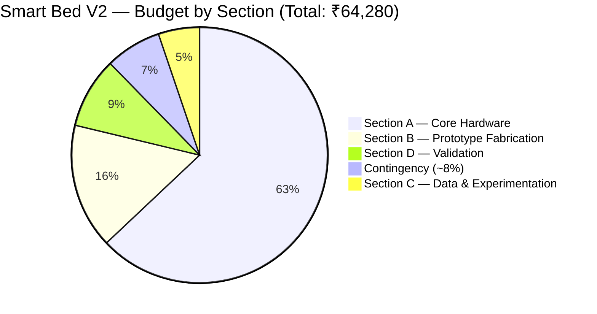

# Budget Slide Content — Smart Bed V2 Proposal

> **Usage:** This file contains all presentation content for the budget slide in your project proposal presentation.  
> **Source of Truth:** Aligned 100% with [ItemizedBudget.md](file:///d:/Smart%20Bed/Budget/ItemizedBudget.md) (August 2026).  
> **Total Budget:** **₹64,280** (Worst Case — All fallback items purchased) / **₹61,480** (Best Case — Institutional reference access).  
> **Funding Limit:** ₹1,00,000 (Uncommitted Surplus: **₹35,720 – ₹38,520** retained for Phase 2).

---

## 🎯 Slide Title

**Smart Bed V2 — Research Prototype Budget**

---

## 📝 Slide Descriptor Text (2–3 sentences max)

> A total prototype budget of **₹61,480–₹64,280** funds an AI-capable edge processing platform (Raspberry Pi 5 8GB), **five non-contact sensor modalities** (60 GHz radar, geophone, pressure matrix, load cells, dual thermal sensors), mechanical bed-retrofit fabrication, and clinical validation protocol. All expenditure remains well within the **₹1,00,000** institutional grant limit, leaving a surplus of **₹35,720** reserved for Phase 2 clinical testing.

---

## 📊 Primary Visual — Mermaid Pie / Donut Chart

Render natively in GitHub/Obsidian, or recreate as a donut chart in PowerPoint using the exact values below.



---

## 📋 Primary Slide Table — Section-Wise Budget (ItemizedBudget.md Sections)

| Section | Description | Key Components Included | Best Case (₹) | Worst Case (₹) | % of Total |
|---|---|---|---:|---:|---:|
| **Section A** | **Core Hardware** | RPi 5 8GB (₹20k), HLK-LD6002 radar, SM-24 geophone, Velostat matrix ×4, load cells ×4, MLX90640, MLX90614, ESP32, ADCs, muxes, power rails | 40,465 | 40,465 | 63.0% |
| **Section B** | **Prototype Fabrication** | Metal cot frame (₹5k), foam mattress, headboard radar mount, overhead camera arm, load cell footpad plates, enclosures, conduits | 10,160 | 10,160 | 15.8% |
| **Section C** | **Data & Experimentation** | Calibration weights set (5 kg), EVA foam backing, thermal reference target, digital thermometer, USB desk fan, documentation, hygiene | 3,350 | 3,350 | 5.2% |
| **Section D** | **Validation** | Reference stopwatch, volunteer honoraria (10 sessions), ethics printing, backup USB drive + *Conditional ref scale/spirometer/oximeter* | 2,950 | 5,750 | 9.0% |
| **Buffer** | **Contingency (~8%)** | Component failures, price variations, shipping buffer | 4,555 | 4,555 | 7.1% |
| | | | | | |
| **TOTAL** | **Procurement + Contingency** | **Full 5-Sensor AI Research Prototype** | **₹61,480** | **₹64,280** | **100%** |
| **SURPLUS** | **Phase 2 Institutional Reserve** | **Uncommitted surplus remaining under ₹1,00,000 cap** | **₹38,520** | **₹35,720** | **—** |

---

## 🔍 Detailed Sub-Component Breakdown (Hardware Sub-Groups)

For slides requiring a granular component breakdown of **Section A — Core Hardware** (₹40,465):

| Sub-Category | Key Components Included | Amount (₹) | % of Total |
|---|---|---:|---:|
| 🖥️ **Processing Platform** | Raspberry Pi 5 (8 GB, ₹20,000), Active Cooler (₹520), MicroSD 64 GB A2 (₹2,800), 27 W PSU (₹1,200), Protective Case (₹1,000) | 25,520 | 39.7% |
| 📡 **Sensors (incl. Geophone)** | HLK-LD6002 radar (₹2,200), Velostat matrix ×4 (₹2,400), Conductive tape (₹900), Load cells ×4 (₹400), MLX90640 (₹5,000), MLX90614 (₹700), SM-24 Geophone (₹500) | 12,100 | 18.8% |
| 🔧 **Prototype Fabrication** | Metal cot, mattress, mounts, camera arm, footpads, enclosures, wiring | 10,160 | 15.8% |
| 🧪 **Data & Validation** | Calibration weights, thermal target, volunteer honoraria, ethics docs + fallback instruments | 9,100 | 14.2% |
| 🛡️ **Contingency (~8%)** | Component buffer & price variation allowance | 4,555 | 7.1% |
| ⚙️ **MCU & Power Electronics** | ESP32, HX711 ×2, CD74HC4067 mux ×3, ADS1115 ×2, breadboards, passives, logic converters, 12V 5A PSU, LM2596 buck converters ×3, serial debug cables | 2,845 | 4.4% |
| | | | |
| **TOTAL (Worst Case)** | *All categories combined* | **₹64,280** | **100%** |

---

## 📌 Key Callout Stat Cards

Place these as highlight stat cards along the bottom of the budget slide:

| Stat Card | Value | Description / Note |
|---|---|---|
| 💰 **Total Prototype Cost (Worst Case)** | **₹64,280** | All hardware, fabrication, validation & conditional fallback items |
| 🏛️ **Total Prototype Cost (Best Case)** | **₹61,480** | With institutional lab access for V2/V3/V4 reference tools (saves ₹2,800) |
| 🎯 **Institutional Funding Ceiling** | **₹1,00,000** | Maximum approved institutional grant limit |
| ✅ **Uncommitted Phase 2 Surplus** | **₹35,720 – ₹38,520** | Retained in institutional grant account for Phase 2 clinical-site testing |
| 📡 **Sensor Array Modalities** | **5 Modalities** | 60GHz radar, SM-24 geophone, Velostat matrix, load cells, dual thermal |
| 🖥️ **Dominant Hardware Cost** | **₹20,000 (31.1%)** | Raspberry Pi 5 8 GB edge AI computing platform |

---

## 🖼️ Recommended Slide Layout

```
┌───────────────────────────────────────────────────────────────────────────┐
│ SLIDE TITLE: Smart Bed V2 — Research Prototype Budget                     │
├───────────────────────────────┬───────────────────────────────────────────┤
│                               │  SECTION-WISE BUDGET TABLE                │
│   DONUT / PIE CHART           │  Section A: Core Hardware  ₹40,465  63.0% │
│   (Mermaid or built-in        │  Section B: Fabrication    ₹10,160  15.8% │
│    presentation chart)        │  Section C: Data & Exp.     ₹3,350   5.2% │
│                               │  Section D: Validation      ₹5,750   9.0% │
│   [Total: ₹64,280 inside]     │  Contingency (~8%):         ₹4,555   7.1% │
│                               │  ──────────────────────────────────────── │
│                               │  TOTAL (Worst Case)        ₹64,280  100%  │
├───────────────────────────────┴───────────────────────────────────────────┤
│  "₹64,280 funds 5 sensor modalities, AI edge compute, fabrication,        │
│  and validation — leaving ₹35,720 surplus for Phase 2 clinical testing."  │
├───────────────────┬───────────────────┬───────────────────┬───────────────┤
│ Total: ₹64,280    │ Limit: ₹1,00,000  │ Surplus: ₹35,720  │ 5 Sensors     │
│ (Best: ₹61,480)   │ (Grant Limit)     │ (Phase 2 Reserve) │ incl. Geophone│
└───────────────────┴───────────────────┴───────────────────┴───────────────┘
```

---

## 🎨 Colour Palette Recommendations

| Section | Hex Code | Colour Name | Swatch |
|---|---|---|---|
| Section A — Core Hardware | `#2E75B6` | Deep Tech Blue | ████ |
| Section B — Prototype Fabrication | `#70AD47` | Forest Green | ████ |
| Section C — Data & Experimentation | `#ED7D31` | Burnt Orange | ████ |
| Section D — Validation | `#7030A0` | Royal Purple | ████ |
| Contingency (~8%) | `#00B0F0` | Bright Teal | ████ |

---

## 💡 Presentation Speaker Notes & Tips

- **Highlight Section A Dominance:** Explain that Section A (Core Hardware, ₹40,465) accounts for 63% of the budget because it houses the edge AI engine (Raspberry Pi 5 8GB, ₹20,000) and all five sensor modalities.
- **Emphasize the Geophone Addition:** Point out that the SM-24 Geophone (Item NEW-3) adds a second independent HR/RR physical pathway for only ₹500.
- **Explain the ₹2,800 Validation Buffer:** Note that reference tools (weighing scale V2, spirometer V3, pulse oximeter V4) are budgeted as a ₹2,800 fallback, but will be accessed via college biomedical labs whenever possible (reducing total to ₹61,480).
- **Emphasize Grant Efficiency:** Highlight that the project utilizes only 64% of the ₹1,00,000 grant, preserving ₹35,720 for Phase 2 clinical validation.

---

*Budget Slide Content — 100% Aligned with ItemizedBudget.md, BudgetVerification.md, and Smart Bed V2.pdf | August 2026*
