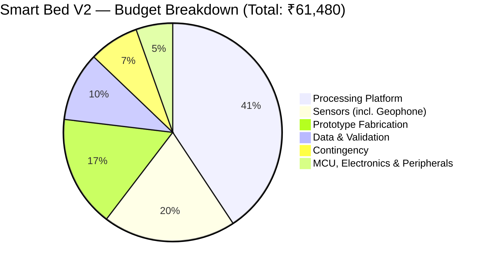

# Budget Slide Content — Smart Bed V2 Proposal

> **Usage:** This file contains all content needed for a single budget slide in your project proposal presentation.
> The Mermaid pie chart renders natively in GitHub, Obsidian, and Notion. For PowerPoint/Google Slides, screenshot the rendered chart or recreate it as a built-in pie/donut chart using the percentages below.
> **Updated:** Geophone sensor (₹500, NEW-3) added. Total revised to ₹64,280 (worst case) / ₹61,480 (best case).

---

## 🎯 Slide Title

**Smart Bed V2 — Research Prototype Budget**

---

## 📝 Slide Descriptor Text (2–3 sentences max)

> A total prototype budget of **₹61,480–₹64,280** funds **five sensor modalities** (mmWave radar, geophone, pressure matrix, load cells, thermal camera), an AI-capable edge computing platform, mechanical fabrication, and clinical validation — well within the ₹1,00,000 institutional limit. Clinical reference instruments (weighing scale, spirometer, pulse oximeter) are sourced through institutional labs wherever possible; a priced fallback of ₹2,800 is reserved in case any are unavailable.

---

## 📊 Primary Visual — Pie / Donut Chart

Render this in GitHub / Obsidian, or recreate as a donut chart in your presentation tool using the values below.



---

## 📋 Slide Table — Category-Wise Budget

| Category | Key Components | ₹ | % |
|---|---|---:|---:|
| 🖥️ Processing Platform | Raspberry Pi 5 (8 GB, ₹20,000), active cooler, 64 GB microSD, 27 W PSU, protective case | 25,020 | 40.7% |
| 📡 Sensors | HLK-LD6002 radar, **geophone (BCG)**, Velostat matrix ×4, load cells ×4, MLX90640 spatial camera, MLX90614 temp sensor | 12,100 | 19.7% |
| 🔧 Prototype Fabrication | Bed/cot, foam mattress, radar & camera mounts, cable management, enclosures | 10,160 | 16.5% |
| 🧪 Data & Validation | Calibration, consumables, volunteer honoraria, ethics docs + conditional clinical ref. instruments | 9,100 | 14.8% |
| ⚙️ MCU, Electronics & Peripherals | ESP32, HX711 ×2, mux ×3, ADS1115 ×2, passives, logic converters, debug cables | 3,345 | 5.4% |
| 🛡️ Contingency (~8%) | Component failure, price variation, shipping buffer | 4,555 | 7.4% |
| | | | |
| **TOTAL (best case)** | *V2/V3/V4 via institutional labs* | **₹61,480** | — |
| **TOTAL (worst case)** | *V2/V3/V4 purchased (₹2,800 extra)* | **₹64,280** | — |
| **Surplus vs. ₹1,00,000 limit** | *Available for Phase 2* | **₹35,720–₹38,520** | — |

---

## 📌 Key Callout Stats
Place these as 4 highlight boxes / stat cards along the bottom of the slide.

| Stat | Value |
|---|---|
| 💰 Total Budget (best case) | ₹61,480 |
| 💰 Total Budget (worst case) | ₹64,280 |
| 🏛️ Funding Limit | ₹1,00,000 |
| ✅ Surplus for Phase 2 | ₹35,720–₹38,520 |
| 📡 Sensor Modalities | 5 (radar + geophone + pressure + load cells + thermal) |
| 🏛️ Clinical instruments (V2/V3/V4) | ₹2,800 reserved as fallback |

---

## 🖼️ Recommended Slide Layout

```
┌─────────────────────────────────────────────────────────────────┐
│  SLIDE TITLE: Smart Bed V2 — Research Prototype Budget          │
├───────────────────────────┬─────────────────────────────────────┤
│                           │  CATEGORY TABLE                     │
│   PIE / DONUT CHART       │  (6 rows + total row)               │
│   (Mermaid or built-in    │                                     │
│    presentation chart)    │  Processing    ₹25,020   40.7%      │
│                           │  Sensors       ₹12,100   19.7%      │
│   [Colour legend below]   │  Fabrication   ₹10,160   16.5%      │
│                           │  Data/Valid.    ₹6,300   10.2%      │
│                           │  Electronics    ₹3,345    5.4%      │
│                           │  Contingency    ₹4,555    7.4%      │
│                           │  ──────────────────────────────     │
│                           │  TOTAL         ₹61,480   100%       │
├───────────────────────────┴─────────────────────────────────────┤
│  "₹61,480 funds 5 sensor modalities, AI edge computing,        │
│  fabrication & validation — ₹35,720 surplus reserved for        │
│  Phase 2 clinical-site validation."                             │
├────────────────┬───────────────┬───────────────┬────────────────┤
│ Total: ₹61,480 │ Limit: ₹1 L   │ Surplus: ₹35K │ 5 Sensors      │
│                │               │ (Phase 2 →)   │ incl. Geophone │
└────────────────┴───────────────┴───────────────┴────────────────┘
```

---

## 🎨 Colour Recommendations (PowerPoint / Google Slides)

| Category | Hex Colour | Swatch |
|---|---|---|
| Processing Platform | `#2E75B6` — Deep Blue | ████ |
| Sensors (incl. Geophone) | `#C00000` — Deep Red | ████ |
| Prototype Fabrication | `#70AD47` — Green | ████ |
| Data & Validation | `#ED7D31` — Orange | ████ |
| MCU, Electronics & Peripherals | `#7030A0` — Purple | ████ |
| Contingency | `#00B0F0` — Teal | ████ |

---

## 💡 Presentation Tips

- **Use a donut chart** (not pie) — the hollow centre lets you place the total `₹61,480` inside for maximum impact.
- **Highlight the geophone** — it adds a second independent HR/RR measurement path for only ₹500. Mention this in the slide notes.
- **Highlight the surplus** — ₹35,720 available for Phase 2 demonstrates responsible budgeting.
- **Do not list all 30 items** — the 6-category table above is all you need on the slide.
- **Institutional access footnote** — add a small `*` note: *"Clinical validation equipment (weighing scale, spirometer, pulse oximeter) accessed via institutional labs — not purchased."*

---

*Source: ItemizedBudget.md · BudgetVerification.md · Smart Bed V2.pdf | August 2026*
*Geophone (NEW-3) added August 2026 — total revised from ₹63,740 to ₹64,280*
