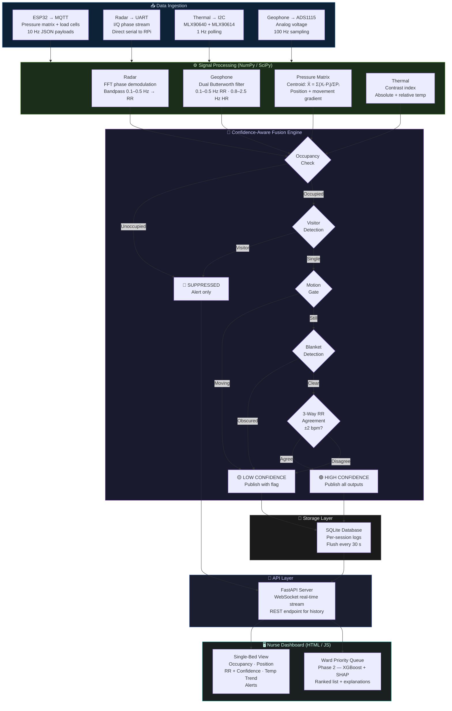

# Slide 10 Diagram — Software Architecture & Data Flow

> **Usage:** Embed or screenshot this diagram for Slide 10 of the presentation.  
> Renders natively in GitHub, Obsidian, Notion, and VS Code with Mermaid extension.

---

---

## Pipeline Stage Reference

| Stage | Technology | Inputs | Outputs |
|---|---|---|---|
| **Data Ingestion** | Mosquitto MQTT, pySerial, smbus2 | Raw sensor bytes | Parsed JSON / NumPy arrays |
| **Signal Processing** | SciPy (Butterworth, FFT), NumPy | Raw time-series | RR estimate, HR estimate, centroid (X̄, Ȳ), thermal contrast index |
| **Fusion Engine** | Python state machine (rule-based) | All processed signals | Confidence state + validated measurements |
| **Storage** | SQLite (WAL mode) | Validated outputs | Per-session time-series database |
| **API** | FastAPI + uvicorn + WebSocket | SQLite + fusion events | JSON streams to frontend |
| **Dashboard** | HTML / JS / Chart.js | FastAPI WebSocket | Real-time single-bed view + Phase 2 ward queue |

---

## Signal Processing Details

| Signal | Filter Type | Frequency Band | Output |
|---|---|---|---|
| Radar phase | FFT + Butterworth bandpass | 0.1–0.5 Hz | Respiratory Rate (bpm) |
| Geophone (breathing) | Butterworth bandpass | 0.1–0.5 Hz | Respiratory Rate — independent path |
| Geophone (cardiac) | Butterworth bandpass | 0.8–2.5 Hz | Exploratory Heart Rate |
| Pressure matrix | Spatial centroid computation | N/A | Body position (X̄, Ȳ) + movement level |
| Thermal | Contrast index + relative temp | N/A | Blanket flag + surface temperature trend |

---

*Slide 10 Diagram — Software Architecture & Data Flow | Smart Bed V2 | August 2026*
