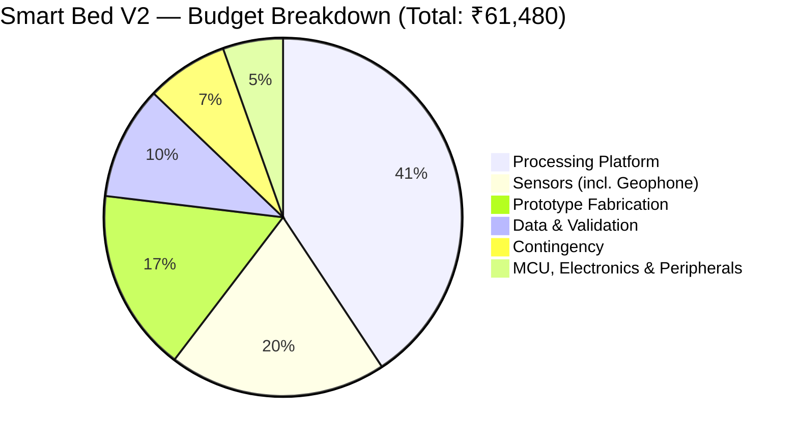

# Slide 14 Diagram — Prototype Budget Breakdown & Research Scope

> **Usage:** Embed or screenshot this diagram for Slide 14 of the presentation.  
> Renders natively in GitHub, Obsidian, Notion, and VS Code with Mermaid extension.

---

## 📊 Prototype Budget Breakdown (Total: ₹61,480 – ₹64,280)

---

## 📋 Category-Wise Expenditure Table

| Category | Key Components Included | Best Case (₹) | % of Total |
|---|---|---:|---:|
| 🖥️ **Processing Platform** | Raspberry Pi 5 (8 GB, ₹20,000), active cooler, 64 GB microSD A2, 27 W PSU, protective case | 25,020 | 40.7% |
| 📡 **Sensors (incl. Geophone)** | HLK-LD6002 60GHz radar, SM-24 geophone, Velostat matrix ×4, load cells ×4, MLX90640, MLX90614 | 12,100 | 19.7% |
| 🔧 **Prototype Fabrication** | Bed/cot frame, foam mattress, radar & camera MS mounts, cable conduits, enclosures | 10,160 | 16.5% |
| 🧪 **Data & Validation** | Calibration weights, test consumables, volunteer honoraria (10 sessions), ethics docs | 6,300 | 10.2% |
| 🛡️ **Contingency (~8%)** | Component failures, price variations, shipping buffer | 4,555 | 7.4% |
| ⚙️ **MCU & Peripherals** | ESP32, HX711 ×2, CD74HC4067 mux ×3, ADS1115 ×2, passives, logic converters | 3,345 | 5.5% |
| | | | |
| **TOTAL (Best Case)** | *Validation reference equipment via institutional labs* | **₹61,480** | **100%** |
| **TOTAL (Worst Case)** | *Reference scale/spirometer/oximeter purchased fallback (+₹2,800)* | **₹64,280** | — |
| **Phase 2 Reserve Surplus** | *Retained within ₹1,00,000 institutional funding limit* | **₹35,720 – ₹38,520** | — |

---

## 📌 Highlight Summary Stats

| Stat | Value | Description |
|---|---|---|
| 💰 **Verified Total Budget** | **₹64,280** | Complete 5-sensor research prototype cost (worst case) |
| 🏛️ **Institutional Grant Limit** | **₹1,00,000** | Maximum approved project funding |
| 📈 **Phase 2 Surplus Reserve** | **₹35,720** | Remaining funds uncommitted & reserved for clinical-site testing |
| 📡 **Sensing Modalities** | **5 Modalities** | Radar (air), Geophone (structure), Velostat (contact), Load Cells, Thermal |

---

*Slide 14 Diagram — Budget Pie Chart & Category Breakdown | Smart Bed V2 | August 2026*
