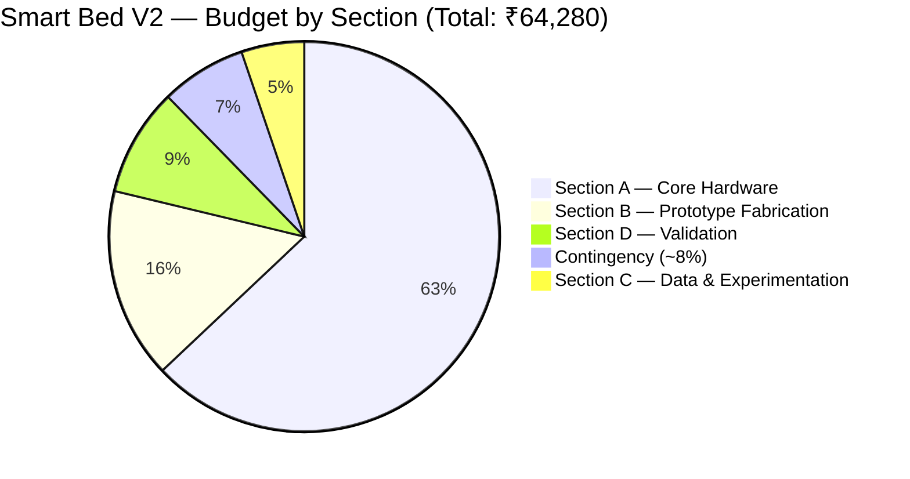

# Slide 14 Diagram — Prototype Budget Breakdown & Research Scope

> **Usage:** Embed or screenshot this diagram for Slide 14 of the presentation.  
> **Source of Truth:** Aligned 100% with [ItemizedBudget.md](file:///d:/Smart%20Bed/Budget/ItemizedBudget.md) (August 2026).  
> Renders natively in GitHub, Obsidian, Notion, and VS Code with Mermaid extension.

---

## 📊 Prototype Budget Breakdown (Total: ₹64,280)

---

## 📋 Section-Wise Expenditure Table (Aligned with ItemizedBudget.md)

| Section | Title | Key Components Included | Best Case (₹) | Worst Case (₹) | % of Total |
|---|---|---|---:|---:|---:|
| **Section A** | **Core Hardware** | RPi 5 8GB (₹20k), HLK-LD6002 radar, SM-24 geophone, Velostat matrix ×4, load cells ×4, MLX90640, MLX90614, ESP32, ADCs, muxes | 40,465 | 40,465 | 63.0% |
| **Section B** | **Prototype Fabrication** | Metal cot frame (₹5k), foam mattress, headboard radar mount, camera arm, footpad plates, enclosures, conduits | 10,160 | 10,160 | 15.8% |
| **Section C** | **Data & Experimentation** | Calibration weights set (5 kg), EVA foam backing, thermal target, ref thermometer, USB desk fan, forms, hygiene | 3,350 | 3,350 | 5.2% |
| **Section D** | **Validation** | Reference stopwatch, volunteer honoraria (10 sessions), ethics printing, backup USB drive + *Conditional ref scale/spirometer/oximeter* | 2,950 | 5,750 | 9.0% |
| **Buffer** | **Contingency (~8%)** | Component failures, price variations, shipping buffer | 4,555 | 4,555 | 7.1% |
| | | | | | |
| **TOTAL** | **Full Prototype Cost** | *All hardware, fabrication, validation & contingency included* | **₹61,480** | **₹64,280** | **100%** |
| **SURPLUS** | **Phase 2 Reserve** | *Uncommitted surplus remaining under ₹1,00,000 grant cap* | **₹38,520** | **₹35,720** | **—** |

---

## 📌 Highlight Summary Stats

| Stat | Value | Description |
|---|---|---|
| 💰 **Verified Total Budget** | **₹64,280** | Complete 5-sensor research prototype cost (worst case) |
| 🏛️ **Institutional Grant Limit** | **₹1,00,000** | Maximum approved project funding limit |
| 📈 **Phase 2 Surplus Reserve** | **₹35,720** | Remaining funds uncommitted & reserved for clinical-site testing |
| 📡 **Sensing Modalities** | **5 Modalities** | Radar (air), Geophone (structure), Velostat (contact), Load Cells, Thermal |

---

*Slide 14 Diagram — Budget Pie Chart & Category Breakdown | Smart Bed V2 | August 2026*
