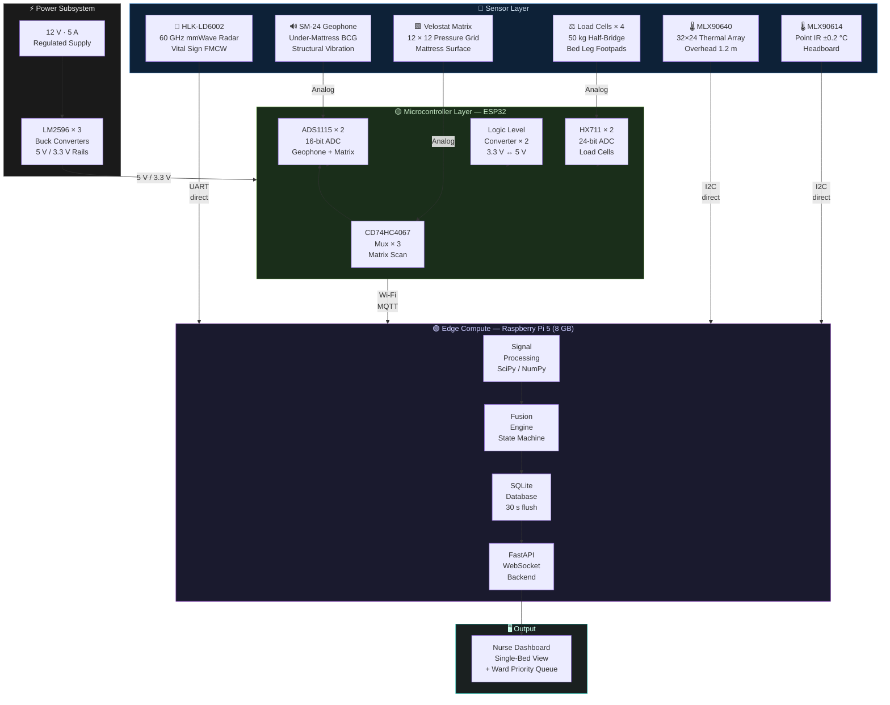

# Slide 9 Diagram — Hardware Architecture

> **Usage:** Embed or screenshot this diagram for Slide 9 of the presentation.  
> Renders natively in GitHub, Obsidian, Notion, and VS Code with Mermaid extension.

---

---

## Component Reference Table

| Layer | Component | Role |
|---|---|---|
| Sensor | HLK-LD6002 (60 GHz FMCW) | Chest wall displacement → RR (primary), HR (exploratory) |
| Sensor | SM-24 Geophone | Structural BCG → RR + HR independent pathway |
| Sensor | Velostat 12×12 Matrix | Body position centroid, movement gate, contact micro-vibration |
| Sensor | Load Cells ×4 + HX711 ×2 | Weight, occupancy, visitor (+30 kg delta), bed-exit (<3 s) |
| Sensor | MLX90640 (32×24 px) | Spatial thermal map, blanket detection, body outline |
| Sensor | MLX90614 (±0.2°C) | Point surface temperature trend |
| MCU | ESP32 WROOM-32 | Scans matrix (via CD74HC4067), reads load cells (via HX711), publishes MQTT |
| MCU | ADS1115 ×2 | 16-bit analog sampling for geophone and pressure matrix signals |
| MCU | CD74HC4067 ×3 | 16-channel mux for 12×12 grid (144-cell) row-column scanning |
| MCU | Logic Level Converters ×2 | 3.3 V ↔ 5 V signal translation at I2C and GPIO interfaces |
| Edge | Raspberry Pi 5 (8 GB) | Signal processing, confidence fusion engine, FastAPI server, SQLite |
| Power | 12 V 5 A Supply + LM2596 ×3 | Regulated 5 V and 3.3 V rails for MCU and sensor subsystems |

---

*Slide 9 Diagram — Hardware Architecture | Smart Bed V2 | August 2026*
