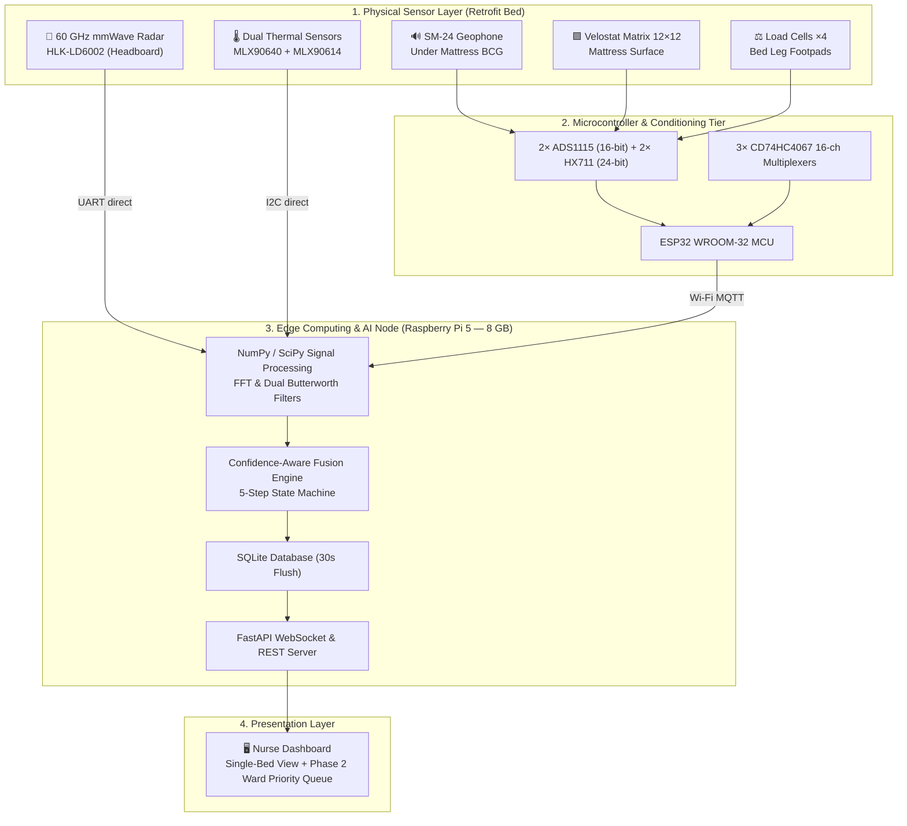
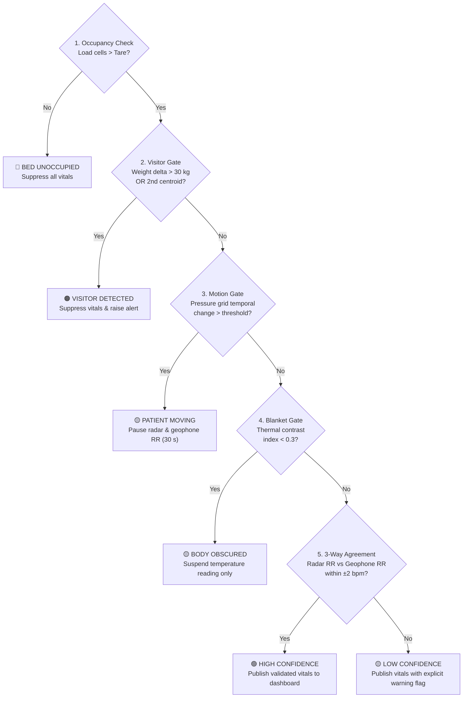

# Smart Bed V2 — AI-Powered Multimodal Contactless Patient Monitoring System

> **Project Vision:** Transforming conventional, non-smart hospital beds into intelligent, non-contact patient monitoring platforms — zero patient body contact, zero workflow friction, and zero bed replacement costs.
>
> **Target Context:** Resource-constrained hospital wards, general wards, and government hospitals in India.  
> **Location:** Coimbatore, Tamil Nadu, India  
> **Prototype Budget:** **₹64,280** (Worst Case) / **₹61,480** (Best Case) | **Institutional Grant Limit:** ₹1,00,000 (Uncommitted Surplus: **₹35,720**)  
> **GitHub Repository:** [Stark6612/SmartBed](https://github.com/Stark6612/SmartBed)

---

## 📑 Table of Contents
1. [Project Overview](#-project-overview)
2. [📁 Repository Structure & Directory Map](#-repository-structure--directory-map)
3. [Quick Navigation — Where to Find What](#-quick-navigation--where-to-find-what)
4. [Key Innovations & Architecture](#-key-innovations--architecture)
5. [Five Sensors & Three Physiological Pathways](#-five-sensors--three-physiological-pathways)
6. [Confidence-Aware Sensor Fusion Engine](#-confidence-aware-sensor-fusion-engine)
7. [Phase 2: Ward Simulation & Explainable AI (XAI)](#-phase-2-ward-simulation--explainable-ai-xai)
8. [Verified Budget & Economics](#-verified-budget--economics)
9. [Regulatory & Safety Disclaimer](#-regulatory--safety-disclaimer)

---

## 🎯 Project Overview

In resource-constrained general hospital wards, high patient-to-nurse ratios (15 to 40 patients per nurse) mean vital signs are checked manually only once every 4 to 8 hours. Patient deterioration between rounds can be gradual and silent, going unnoticed until an acute crisis occurs.

Existing commercial smart beds cost **₹10–50 lakh** per unit, making them financially unviable for general ward deployment. Single-sensor contactless solutions (such as camera-only or radar-only setups) fail up to 30% of the time in real-world conditions due to patient movement, blankets, or visitors sitting on the bed — outputting corrupted numbers silently without warning the clinical staff.

**Smart Bed V2** solves both challenges by:
1. **Retrofitting existing single-person hospital cots** (₹0–5,000 cot cost) with a moderate-cost five-sensor array (total prototype cost **₹64,280**).
2. **Implementing a Confidence-Aware Fusion Engine** that explicitly detects environmental interference (movement, visitors, blankets) and states measurement trust (*High Confidence*, *Low Confidence*, or *Suppressed*) before presenting data to nurses.

---

## 📁 Repository Structure & Directory Map

```text
Smart Bed/
├── README.md                                  # Root project overview & sitemap (this file)
│
├── Budget/                                    # Financial verification & itemized expenditure
│   ├── ItemizedBudget.md                      # Verified itemized budget breakdown (Source of Truth)
│   ├── BudgetVerification.md                  # Component verification report & price audit
│   ├── Budget.md                              # Institutional budget summary
│   └── Updates.docx                           # Historical budget log
│
├── Concept and Validation/                    # Academic concept, research analysis & technical specs
│   ├── Validated Concept.md                   # Core system specification & Mermaid architecture diagrams
│   ├── Analysis and Validation.md             # 17-section technical feasibility & literature validation
│   └── Smart Bed V2.pdf                       # Original institutional project proposal document
│
├── Presentation Content/                      # Slide decks, speaker notes & visual diagram guides
│   ├── AI-Powered Multimodal Contactless Patient Monitoring System.pptx # Official 19-slide presentation deck
│   ├── Presentation Notes Final.md            # Slidewise speaker notes & talking points for all 19 slides
│   ├── Slide Structure.md                     # 15-topic master presentation outline & purpose matrix
│   ├── Slidewise Content.md                   # Detailed slide content breakdown & presentation tips
│   ├── Diagrams.md                            # Complete copy-paste prompt guide for Napkin AI visuals
│   ├── Budget_Slide_Content.md                # Budget presentation slide template, layout & donut chart
│   ├── Slide 9 Diagram.md                     # Hardware Architecture Mermaid flowchart & component table
│   ├── Slide 10 Diagram.md                    # Software Architecture & Data Flow Mermaid flowchart
│   └── Slide 14 Diagram.md                    # Budget Pie Chart & Summary Stats Mermaid diagram
│
├── Prompts/                                   # LLM execution prompts for analysis & verification
│   ├── AnalysisPrompt.md                      # Feasibility analysis prompt
│   ├── BudgetPrompt.md                        # Budget verification prompt
│   └── VerificationPrompt.md                  # Concept alignment verification prompt
│
└── Research Papers/                           # Literature base & evidence repository
    ├── Research Summary.md                    # Structured summaries & key findings of all 8 papers (R1–R8)
    ├── 1-s2.0-S0263224125021189-main.pdf       # R1: Lee et al. (2025) — Load cell fall/exit sensing
    ├── A novel bed-based ballistocardiography...pdf # R2: López-Ruiz et al. (2025) — Smartphone BCG
    ├── fmedt-7-1728913.pdf                    # R4: Padaki et al. (2026) — 111 ED patient contactless rPPG
    ├── fmedt-8-1759641.pdf                    # R5: Shaya et al. (2026) — 315 ED patient TAMAR radar trial
    ├── Healthcare Tech Letters...pdf          # R3: Chen et al. (2024) — FMCW Doppler vital sign radar
    ├── s41597-025-05936-3.pdf                 # R6: Qiu et al. (2025) — BCG + ECG public dataset
    ├── s41597-025-06449-9.pdf                 # R7: Reyes et al. (2026) — SiViS multi-patient radar dataset
    └── sensors-26-01092-v2.pdf                # R8: Pitafi et al. (2026) — Geophone BCG on Raspberry Pi
```

---

## 🔍 Quick Navigation — Where to Find What

| What You Need | Target File / Directory |
|---|---|
| **System Architecture & Hardware Specs** | [Concept and Validation/Validated Concept.md](file:///d:/Smart%20Bed/Concept%20and%20Validation/Validated%20Concept.md) |
| **Verified Component Costs & Part Numbers** | [Budget/ItemizedBudget.md](file:///d:/Smart%20Bed/Budget/ItemizedBudget.md) |
| **Complete PowerPoint Presentation Deck** | [Presentation Content/AI-Powered Multimodal...pptx](file:///d:/Smart%20Bed/Presentation%20Content/AI-Powered%20Multimodal%20Contactless%20Patient%20Monitoring%20System.pptx) |
| **Slidewise Speaker Script & Presentation Notes** | [Presentation Content/Presentation Notes Final.md](file:///d:/Smart%20Bed/Presentation%20Content/Presentation%20Notes%20Final.md) |
| **Copy-Paste Prompts for Napkin AI Diagrams** | [Presentation Content/Diagrams.md](file:///d:/Smart%20Bed/Presentation%20Content/Diagrams.md) |
| **Academic Feasibility & Literature Validation** | [Concept and Validation/Analysis and Validation.md](file:///d:/Smart%20Bed/Concept%20and%20Validation/Analysis%20and%20Validation.md) |
| **Summaries of All 8 Research Papers (R1–R8)** | [Research Papers/Research Summary.md](file:///d:/Smart%20Bed/Research%20Papers/Research%20Summary.md) |
| **Hardware Architecture Mermaid Diagram** | [Presentation Content/Slide 9 Diagram.md](file:///d:/Smart%20Bed/Presentation%20Content/Slide%209%20Diagram.md) |
| **Software Pipeline & Data Flow Diagram** | [Presentation Content/Slide 10 Diagram.md](file:///d:/Smart%20Bed/Presentation%20Content/Slide%2010%20Diagram.md) |
| **Budget Pie Chart & Breakdown Diagram** | [Presentation Content/Slide 14 Diagram.md](file:///d:/Smart%20Bed/Presentation%20Content/Slide%2014%20Diagram.md) |

---

## 💡 Key Innovations & Architecture



---

## 📡 Five Sensors & Three Physiological Pathways

The system combines five complementary sensors to create **three independent measurement pathways** for physiological cross-validation:

| Pathway / Sensor | Placement | Physical Mechanism | Primary Output | Blanket-Proof? |
|---|---|---|---|---|
| **Pathway 1 (Through Air)**<br/>HLK-LD6002 mmWave Radar (60 GHz) | Headboard (0.6 m height), directed at patient chest | Sub-mm chest wall displacement via Doppler phase shift | Respiratory Rate (RR), Exploratory HR | Partially |
| **Pathway 2 (Through Structure)**<br/>SM-24 Geophone | Under mattress (beneath upper torso) | Mechanical heartbeat & breathing recoil vibrations (BCG) | Respiratory Rate (RR), Exploratory HR | ✅ Yes |
| **Pathway 3 (Through Contact)**<br/>Velostat Pressure Matrix (12×12 grid) | Mattress surface (under thin sheet) | Surface pressure micro-vibration & posture centroid | Body Position (4-class), Movement Level | ✅ Yes |
| **Validation Channel 1**<br/>4× Load Cells (50 kg half-bridge) | All 4 bed leg footpads | Total weight bridge voltage delta | Occupancy, Visitor (>30kg), Bed-Exit (<3s) | ✅ Yes |
| **Validation Channel 2**<br/>MLX90640 Spatial + MLX90614 Point IR | Overhead arm (1.2 m) + headboard | IR spatial array (32×24 px) + point forehead IR (±0.2°C) | Surface Temp Trend, Blanket Coverage Index | ❌ No |

---

## 🔀 Confidence-Aware Sensor Fusion Engine

Rather than reporting unverified numbers, the fusion engine evaluates **five sequential validity gates**:



---

## 🤖 Phase 2: Ward Simulation & Explainable AI (XAI)

While **Phase 1** validates physical single-bed hardware, **Phase 2** extends the system into a software-simulated multi-patient ward at **₹0 additional hardware cost**:

1. **Scenario Dataset (Phase 1 Output):** Collects labelled scenario recordings (`quiet_rest`, `elevated_rr`, `sustained_pressure`, `bed_exit_attempt`, `visitor_present`).
2. **Synthetic Ward Synthesizer:** Composes recordings into 4-to-8 bed virtual ward snapshots.
3. **XGBoost Classifier:** Ranks patient priority (*Low*, *Medium*, *High*, *Immediate*).
4. **SHAP Explainability Engine:** Generates natural-language reasons per bed on the dashboard:
   > *"Bed 3 — HIGH PRIORITY: Elevated RR +35% above baseline (High Confidence) → +0.42 · Sustained sacral pressure 2.2 h → +0.31 · Surface temp +0.7°C → +0.18"*

---

## 💰 Verified Budget & Economics

> All component prices verified against local Indian electronics distributors (August 2026).

| Section | Description | Key Components Included | Best Case (₹) | Worst Case (₹) | % Total |
|---|---|---|---:|---:|---:|
| **Section A** | **Core Hardware** | Raspberry Pi 5 8GB (₹20,000), 60GHz radar (₹2,200), geophone (₹500), Velostat grid (₹2,400), load cells ×4 (₹400), MLX90640 (₹5,000), MLX90614 (₹700), ESP32, ADCs, muxes, power rails | 40,465 | 40,465 | 63.0% |
| **Section B** | **Prototype Fabrication** | Single metal cot frame (₹5,000), foam mattress (₹2,000), MS radar mount, camera arm, footpad sandwich plates, enclosures, cabling | 10,160 | 10,160 | 15.8% |
| **Section C** | **Data & Experimentation** | Calibration weights set (5 kg), EVA foam backing, thermal target, ref digital thermometer, USB desk fan, forms & hygiene | 3,350 | 3,350 | 5.2% |
| **Section D** | **Validation** | Reference stopwatch, volunteer honoraria (10 sessions), ethics printing, backup USB drive + *Conditional ref scale/spirometer/oximeter* | 2,950 | 5,750 | 9.0% |
| **Buffer** | **Contingency (~8%)** | Component failure allowance, price variation & shipping buffer | 4,555 | 4,555 | 7.1% |
| | | | | | |
| **TOTAL** | **Full Prototype Cost** | **Complete 5-sensor AI research prototype** | **₹61,480** | **₹64,280** | **100%** |
| **SURPLUS** | **Institutional Reserve** | **Uncommitted surplus remaining under ₹1,00,000 grant cap** | **₹38,520** | **₹35,720** | **—** |

---

## ⚠️ Regulatory & Safety Disclaimer

1. **Research Prototype Status:** Smart Bed V2 is a **research prototype** developed for observational validation and academic proof-of-concept testing.
2. **No Diagnostic Claims:** All system outputs (Respiratory Rate, Body Position, Occupancy, Surface Temperature Trend) are **observational alerts**, not clinical medical diagnoses.
3. **Regulatory Framing:** The project explicitly avoids triggering medical device regulatory classifications (such as CDSCO Medical Device Rules 2017) by framing all software outputs as *"intelligent sensor observation with actionable alerts for nursing staff."* Clinical diagnosis and intervention remain exclusively with trained medical professionals.

---

*Smart Bed V2 Repository Documentation | Coimbatore, Tamil Nadu, India | August 2026*  
*Maintained by: [Stark6612](https://github.com/Stark6612)*
